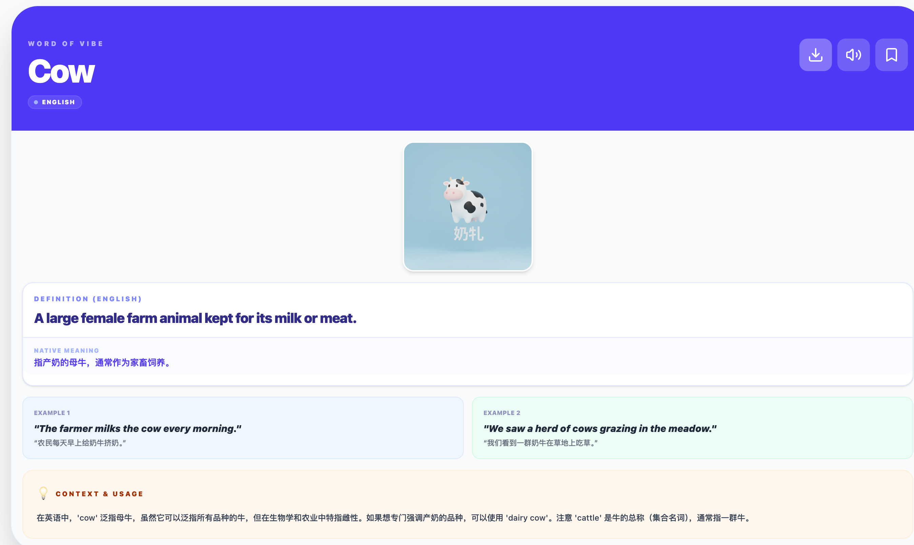
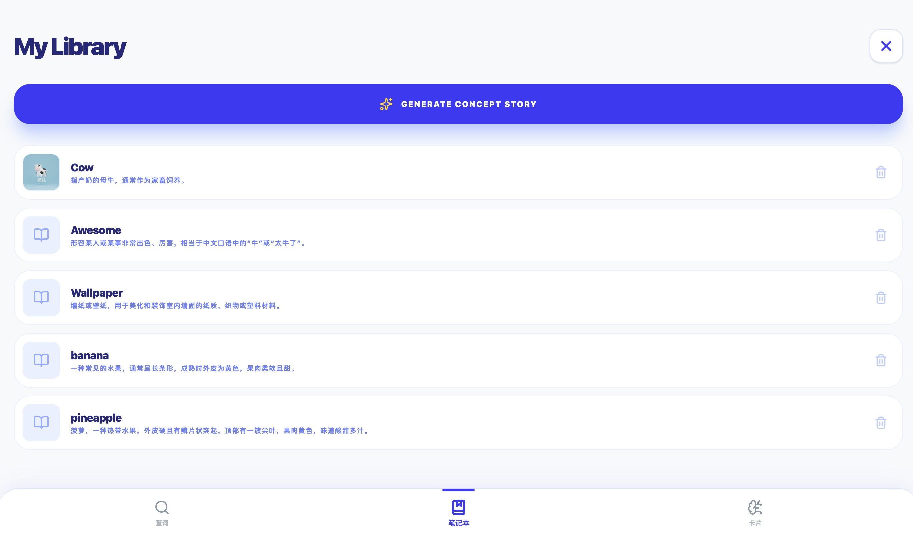

   
   
   
   

## 功能介绍
* 支持多种语言切换
* AI生成词汇概念图片，辅助记忆
* 嵌入大模型问答功能，随时查询对应词汇的相关信息
* 可收藏单词，并针对性练习

## 环境:  Node.js

1. Install dependencies:
   `npm install`
2. Set the `GEMINI_API_KEY` in [.env.local](.env.local) to your Gemini API key
3. Run the app:
   `npm run dev`
